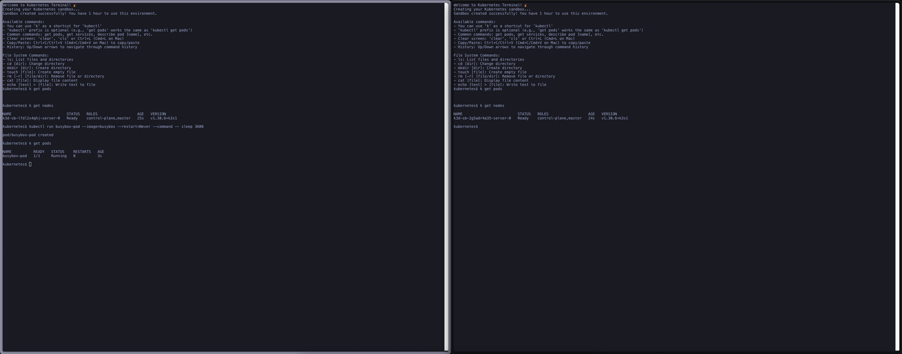

# k8s-learn

An interactive web application to learn and practice Kubernetes commands through a web terminal.



🔗 [Access K8s Learn](https://k8s-learn.joaobarros.dev/)

## 🚀 Features

- Interactive web terminal with real-time command execution
- Full kubectl command support in an isolated environment
- User-friendly interface for Kubernetes resource visualization
- Safe environment for practice and learning
- Automatic sandbox cleanup after 1 hour
- Real Kubernetes cluster using k3d
- No installation required - practice directly in your browser

## 🛠️ Architecture

### Frontend

- Next.js 15 with React and TypeScript
- TailwindCSS for styling
- xterm.js for terminal emulation
- Responsive design with dark/light theme

### Backend

- Node.js with Express
- k3d for isolated Kubernetes clusters
- Automatic sandbox cleanup system
- Cookie-based session management
- Rate limiting and concurrent request protection

## 📦 Local Development

### Prerequisites

- Node.js 20.x
- pnpm
- Docker
- k3d
- kubectl

### Environment Setup

1. Clone the repository:

```bash
git clone https://github.com/joao208/k8s-learn.git
cd k8s-learn
```

2. Start with Docker Compose (recommended):

```bash
docker-compose up --build
```

Or start each service separately:

### Frontend

```bash
cd frontend
pnpm install
pnpm dev
```

### Backend

```bash
cd backend
cp .env.example .env
pnpm install
pnpm dev
```

The frontend will be available at `http://localhost:3000` and the backend at `http://localhost:3001`.

## 🔒 Security

- Isolated sandboxes per user using k3d
- Automatic expiration after 1 hour of use
- Execution in isolated Kubernetes cluster
- No persistence between sessions
- Secure cookies with httpOnly and sameSite
- IP-based rate limiting
- Protection against concurrent requests

## 🤝 Contributing

We love community contributions! Please read our [Contributing Guide](CONTRIBUTING.md) to get started.

### Areas for Contribution

- Adding new commands and features
- UI/UX improvements
- Documentation and tutorials
- Bug fixes
- Automated testing

## 📝 License

This project is licensed under the MIT License - see the [LICENSE](LICENSE) file for details.

## 📞 Support

- Open an [issue](https://github.com/joao208/k8s-learn/issues) to report bugs
- Use [discussions](https://github.com/joao208/k8s-learn/discussions) for suggestions and questions
